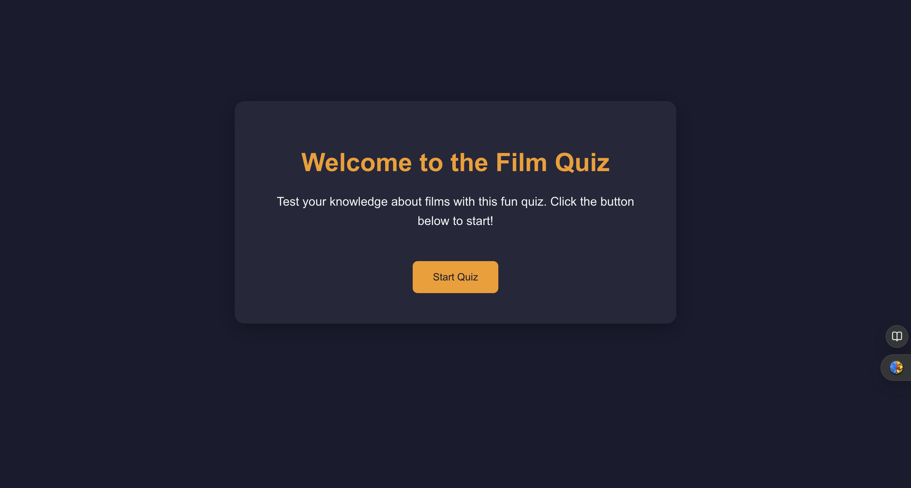
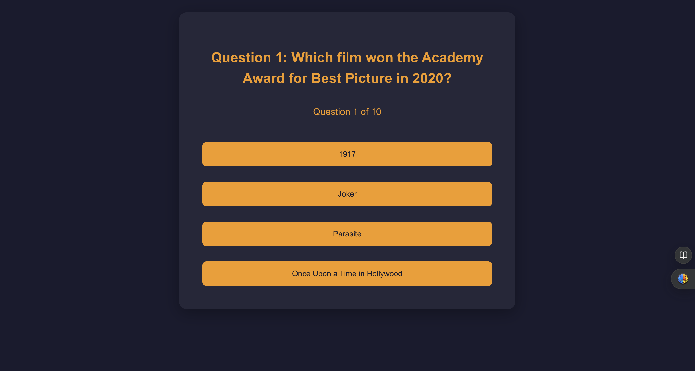

# Film Quiz Project

An interactive web-based quiz application that tests users' knowledge of classic and contemporary cinema. Perfect for film enthusiasts who want to challenge themselves on famous movies, directors, actors, and iconic moments from film history.

## Purpose

This quiz will allow the users to test their knowledge not only against themselves but they can also challenge a friend to see who knows more about film.

## Features

- **Random question order**: Everytime you re do the quiz the questions are rarely in the same place as they were the previous time.
- **Score calculation**: It lets you know how many you got wrong/right.
- **Multiple choice**: It allows you to choose from four options.
- **Responsive design**: It will work on any phone screen no matter what.

## Technologies Used

- **React**: JavaScript library for building interfaces
- **JavaScript**: Used to create the questions and options and to build the question shuffle.
- **HTML**: Help create the interface by creating the headings and text seen on the display.
- **CSS**: This styled the entire application from the colours to the spacing between the questions.
- **Vite**: This powered the local web application so I could review it and alter if needed.
- **Git/GitHub**: This allows me to push and commit all changed made during this project to my repository so other users can view them.

## Installation

Follow these steps to run the project locally:

1. **Clone the repository**:

```bash
   git clone https://github.com/DanSmith8011/film-quiz-project.git
```

2. **Navigate to the project directory**:

```bash
   cd film-quiz-project
```

3. **Install dependencies**:

```bash
   npm install
```

4. **Run the development server**:

```bash
   npm run dev
```

5. Open your browser and go to `http://localhost:5173` to view the quiz

## Testing

This project has been validated using industry standard tools:

### Code validation

- **HTML Validation (W3C)**: Passed
- **CSS Validation (Jigsaw)**: Passed
- **JavaScript Linting (ESLint)**: Passed

### Browser Testing

- Tested on Google Chrome using a Windows desktop.
- Responsive design verified using browser developer tools.
- Mobile compatibility confirmed across multiple screen sizes.

## Deployment

This project is deployed using GitHub Pages.

### Deployment Steps

1. **Build the project**:

```bash
   npm run build
```

2. **Push all changes to GitHub**:

```bash
   git add .
   git commit -m "Prepare for deployment"
   git push
```

3. **Configure GitHub Pages**:

   - Go to your repository on GitHub
   - Click on **Settings**
   - Scroll to **Pages** section
   - Under **Source**, select **main** branch
   - Click **Save**

4. Your site will be live at: `https://dansmith8011.github.io/film-quiz-project/`

## Screenshots

### Instructions Screen

*Welcome screen with quiz instructions and start button*

### Quiz Screen  

*Multiple choice questions with answer options*

### Results Screen

*Final score display with option to retake quiz*

## About This Project

This project was created as part of my web development course to demonstrate proficiency in:
- Building interactive web applications
- Implementing responsive design principles
- Managing state and component architecture
- Following industry-standard development practices including version control and code validation

The project helped me develop practical skills in modern JavaScript frameworks and professional development workflows.